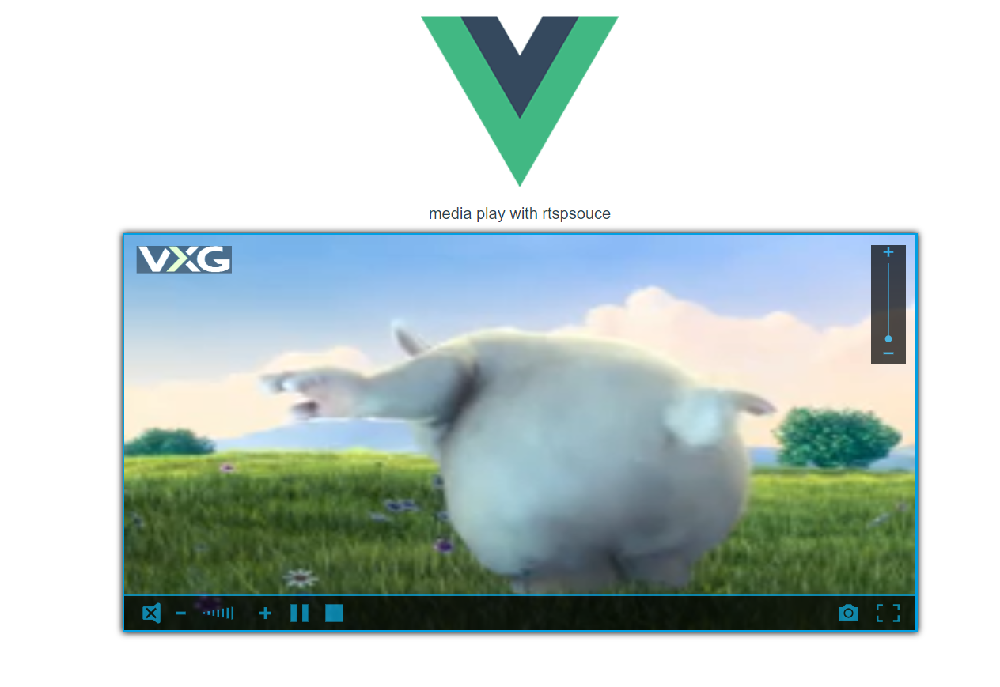

# rtsp_demo

## Project setup

```
yarn install
```

### Compiles and hot-reloads for development

```
yarn serve
```

### Compiles and minifies for production

```
yarn build
```

### Customize configuration

See [Configuration Reference](https://cli.vuejs.org/config/).

### preview

```
  type http://localhost:8080 into site
```

### preview images

<table>
  <tr>
    <td>
        <center></center>
    </td>
        <td>
        <center></center>
    </td>
  </tr>
</table>
